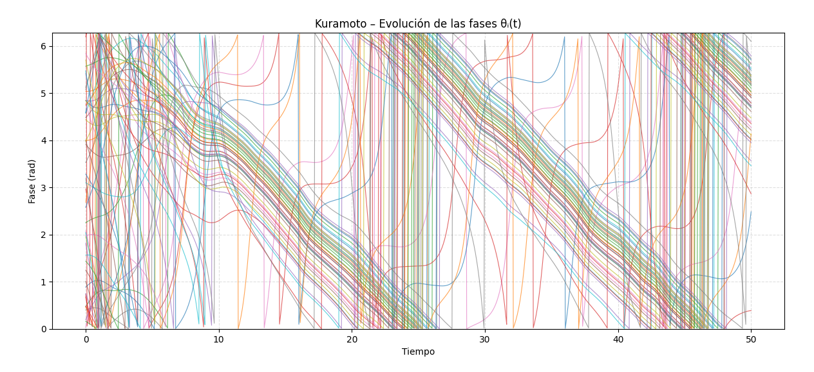
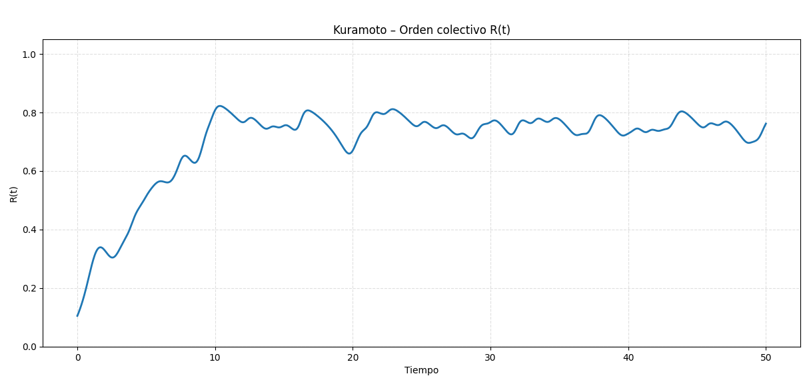
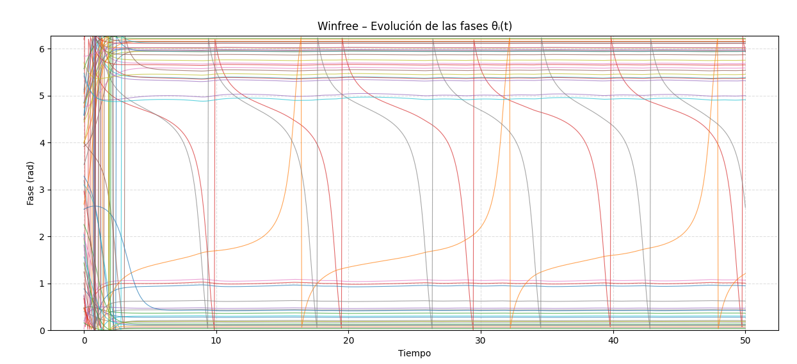
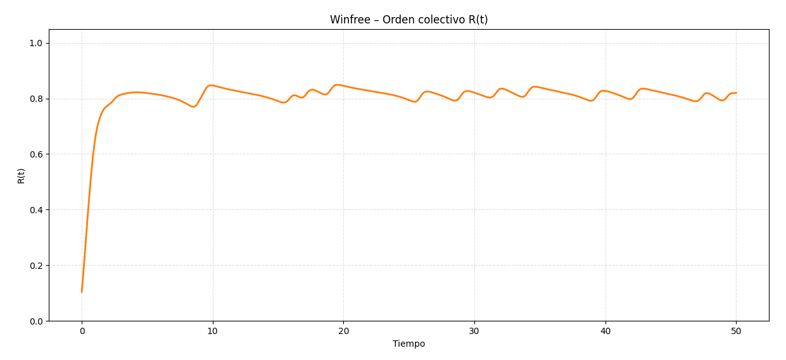
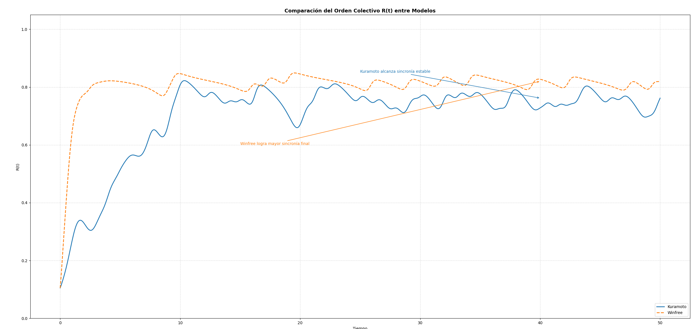

# **Modelos de sincronización: Kuramoto vs Winfree**

Se ejecutó la simulación de ambos modelos con un tiempo de 50 unidades y 100 pasos, con un total de 50 osciladores. A continuación se mostrarán los resultados junto a la comparación para determinar cuál de estos fue mejor.

## **Resultados modelo Kuramoto**

Cada línea de color representa un oscilador, al inicio, las fases están distribuidas aleatoriamente y con el tiempo, algunos comienzan a moverse en grupo, pero nunca llegan a estar perfectamente alineados. Esto quiere decir que llega a haber sincronia parcial

``R(t)`` mide el grado de sincronización (entre 0 y 1) siendo 0 fases totalmente desordenadas y 1 sincronización perfecta.

Se puede observar que **``R(t)``** sube rápidamente hasta alcanzar una sincronia entre **0.7** y **0.8** donde luego se estabiliza con pequeñas oscilaciones, lo que se conoce como una sincronización parcial estable.

## **Resultados modelo Winfree**

En este caso, las fases tienden a alinearse mucho más rápido, las líneas convergen visualmente a trayectorias similares lo que indica que casi todos los osciladores entran en fase.
Esto ocurre porque el modelo Winfree tiene un acoplamiento a través del pulso medio ***⟨P(θ)⟩***, lo que hace que los osciladores influyan más directamente entre sí.
En otras palabras: reaccionan al promedio colectivo, no solo a las diferencias de fase.

Aquí **``R(t)``** sube rápidamente cerca de **0.8** y se mantiene allí con muy leves fluctuaciones.

## **Resultados númericos**

| Modelo   | R_final  | R_promedio_último_10% |
| -------- | -------- | --------------------- |
| Kuramoto | 0.761883 | 0.739743              |
| Winfree  | 0.820088 | 0.804802              |

Se puede observar que el modelo de Winfree posee una mayor sincronización con respecto al modelo de Kuramoto.

## **Comparativa**

| Aspecto                | Kuramoto                                              | Winfree                                                      |
| ---------------------- | ----------------------------------------------------- | ------------------------------------------------------------ |
| Tipo de acoplamiento   | Por diferencias de fase | Por pulso promedio  |
| Sincronización         | Parcial                                               | Casi completa                                                |
| Velocidad de sincronía | Moderada                                              | Rápida                                                       |
| R(t) final             | ~0.76                                                 | ~0.82                                                        |
| Interpretación         | Requiere acoplamiento alto para sincronizar           | Puede sincronizar con menor acoplamiento                     |

Como conclusión teniendo en cuenta los resultados obtenidos, podemos observar que el modelo de Winfree logra una sincronización más rápida y más fuerte que el modelo de Kuramoto con los mismos parámetros iniciales.

## Aplicaciones reales de estos modelos

Ambos modelos se utilizan para describir sincronización espontánea en sistemas complejos, por ejemplo:

| Sistema real                            | Descripción                                                                            |
| --------------------------------------- | -------------------------------------------------------------------------------------- |
| **Ritmos circadianos**               | Las células del reloj biológico se sincronizan entre sí (Winfree fue pionero en esto). |
| **Neurociencia**                      | Sincronización de disparos neuronales, relacionada con ritmos cerebrales.              |
| **Osciladores eléctricos / láseres** | Sincronización de señales en circuitos acoplados.                                      |
| **Cardiología**                      | Las células del marcapasos cardíaco se sincronizan para generar el ritmo del corazón.  |

## Miembros del grupo
- Laura González
- Camilo Madero
- Paula Páez